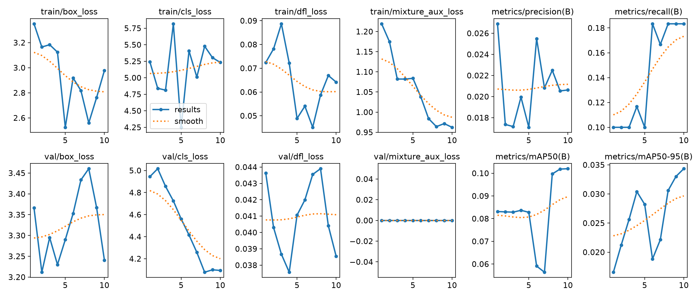
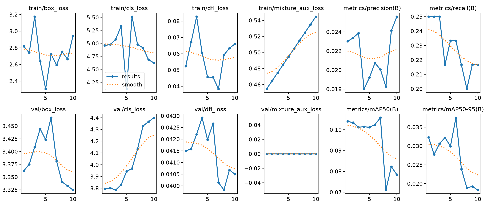

# E3 Routing Observer · P1

P1 在 [P0 统一采集库](https://github.com/XavierYChen/e3-routing-p0) 上增加两项验收能力：

1. 不依赖云服务的本地实时路由面板，覆盖 MOE、MOT、LATENT；
2. 真实 COCO8 训练 on/off、AB/BA 交替、重复测量和置信区间，门槛为中位减速 <10%。

阶段导航：[Smoke](https://github.com/XavierYChen/e3-routing-smoke) · [P0](https://github.com/XavierYChen/e3-routing-p0) · **P1（本仓库）** · [P2 token 原图叠加与演示](https://github.com/XavierYChen/e3-routing-p2) · [最终报告与消融](https://github.com/XavierYChen/e3-routing-final-report)。

实时面板使用浏览器原生 HTML/JavaScript，每秒读取原子更新的 `latest.json`。训练线程同时追加 `routing_records.jsonl`，断电前的历史仍然保留。没有修改腾讯核心 forward。

## 2026-09-09 预训练 GPU 正式重跑

为让 P1 的训练状态能继续服务 P2，本次从腾讯仓库提供的 `yolo26n.pt` 迁移兼容权重，在 RTX 3060 Laptop GPU 上使用 COCO8、640px、10 epochs、seed 0/1/2 重新执行三族配对基准。开销实验固定 FP32、batch=1，并每 8 个 batch 采集一次；每个 40-batch 训练仍得到 5 个时间点。三族中位开销全部低于 10%。

| 路由族 | 三组 on/off 比值 | 中位减速 | bootstrap 95% 区间 | 写入记录 | 结论 |
|---|---|---:|---:|---:|---|
| **MOE** | `1.0331 / 0.9816 / 0.9905` | **-0.95%** | -1.84% ～ +3.31% | 90 | 通过 |
| **MOT** | `1.0962 / 1.0215 / 0.9994` | **+2.15%** | -0.06% ～ +9.62% | 60 | 通过 |
| **LATENT** | `1.0302 / 1.0166 / 0.9847` | **+1.66%** | -1.53% ～ +3.02% | 45 | 通过 |


负开销表示进程调度噪声范围内没有可辨别减速，不解释为采集提升训练速度。MOT 在当前 CUDA 栈上存在跨进程非确定性：off/off 基线的平均相对 loss 漂移为 2.33%、最大 12.23%；正式 on/off 因此公开轨迹漂移，但仍强制初始权重和所有训练批次指纹一致。MOE 与 LATENT 的 on/off loss 则逐批一致。完整证据见 [`results/verified-p1-gpu-pretrained-10e-20260909`](results/verified-p1-gpu-pretrained-10e-20260909)。

另行保存的训练后权重不进入开销计时。MOT best 为 epoch 10，mAP50 `0.1020`、mAP50-95 `0.0343`；MOA best 为 epoch 6，mAP50 `0.1025`、mAP50-95 `0.0375`。它们比旧版随机起点/零验证结果更适合做 P2 路由诊断，但 COCO8 只有 4 张训练图且与 COCO 预训练域重合，不能作为泛化性能结论。公开仓库提交曲线、预测图、配置与 checkpoint 哈希，权重保留本地。





## 历史 CPU 基线（仅作调度噪声对照）

2026-09-07 在 Windows 11、Intel i7-12700H CPU 上完成真实 COCO8 配对训练。每族运行 7 组，每组分别关闭和开启采集；每次 5 epochs。三族的中位减速均低于 P1 的 10% 门槛。

| 路由族 | 中位减速 | bootstrap 95% 区间 | 写入记录 | 结论 |
|---|---:|---:|---:|---|
| MOE | +2.97% | -5.08% ～ +11.08% | 210 | 通过 |
| MOT | +1.57% | +0.51% ～ +5.37% | 140 | 通过 |
| LATENT | +4.21% | -0.14% ～ +7.89% | 105 | 通过 |

这组结果已经被 2026-09-09 的 GPU、预训练、10-epoch 正式结果取代，README 不再展示其旧图。原始证据仍保留在 [`results/verified-p1-cpu-v2-20260907`](results/verified-p1-cpu-v2-20260907) 供追溯：MOT 的 95% 区间由 3 次重复时的 -4.25%～+14.26% 收窄为 7 次重复时的 +0.51%～+5.37%；MOE 有一次明显的 CPU 调度异常值。它不参与当前 P1 验收数字。

### 为什么历史 CPU 面板中的 LATENT 都是 0.25

这是旧 CPU 基线中腾讯 LATENT 配置的可复现初始化状态，不是绘图补值。三个 `LatentMixture` 都有 4 个专家，配置把 `router_init_std` 和 `residual_init` 设为 `0.0`；实现因此把路由输出层权重、偏置初始化为 0，softmax 后自然得到 `[0.25, 0.25, 0.25, 0.25]`。该旧基准只有 10 个训练 batch，目的只是测量采集开销。当前验收结论以上方 10-epoch GPU 正式结果为准。

## 运行基准

```bat
cd /d D:\AI\E3-Routing-P1
set "E3_YOLO_MASTER_ROOT=D:\AI\YOLO-Master"
set "E3_P0_ROOT=D:\AI\E3-Routing-P0"
set "E3_PYTHON=D:\AI\envs\yolo_master\python.exe"
run_benchmark.cmd
```

运行新版预训练 GPU 基准与 P2 权重训练：

```bat
run_benchmark_gpu_pretrained.cmd
run_specialization.cmd
```

打开某次 on 运行的面板：

```bat
run_dashboard.cmd results\你的运行目录\dashboard\moe\rep-0
```

浏览器访问 `http://127.0.0.1:8765/dashboard.html`。服务器只监听本机。

测试采集和面板逻辑：

```bat
run_tests.cmd
```

## 当前正式口径

- 配置文件为 [`configs/p1_gpu_pretrained_coco8.json`](configs/p1_gpu_pretrained_coco8.json)，解析后的完整配置同时写入正式结果 `summary.json`。
- 每族 3 个 seed/repetition，off/on 与 on/off 交替执行；每次 10 epochs、batch=1、imgsz=640、CUDA:0、FP32、workers=0。
- 每次丢弃前 4 个 batch 作为 warm-up，每 8 个 batch 采集一次；on 时间包含 hook、校验、JSONL 追加和 `latest.json` 原子更新。
- 先计算每个 seed 的 on/off 平均 batch 时间比值，再报告三组比值的中位减速和 bootstrap 95% 区间。
- 每个条件在独立 Python 进程中运行；相同重复的初始模型、输入 batch 和逐 batch loss 必须完全配对，否则基准直接失败。
- 默认删除框架生成的 1 GB 以上临时 checkpoint；如确需保留，可传入 `--keep-train-artifacts`。

实现范围、测量解释和已知问题见 [`limitations.md`](limitations.md)，验收逐项证据见 [`docs/ACCEPTANCE.md`](docs/ACCEPTANCE.md)。

