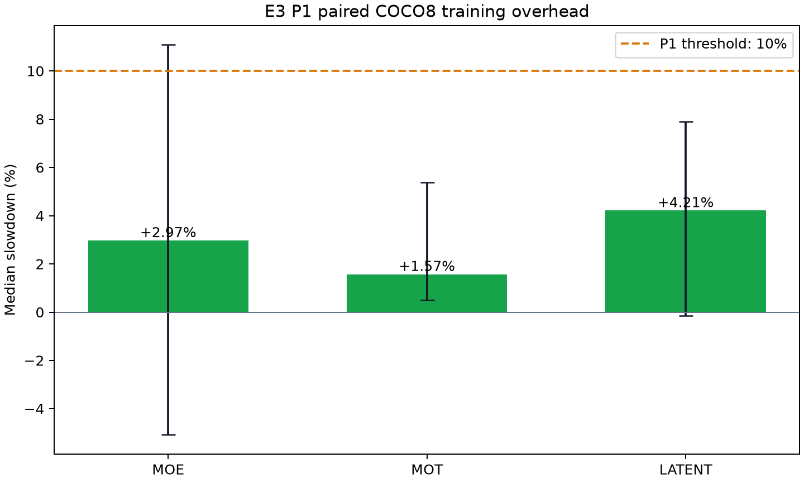
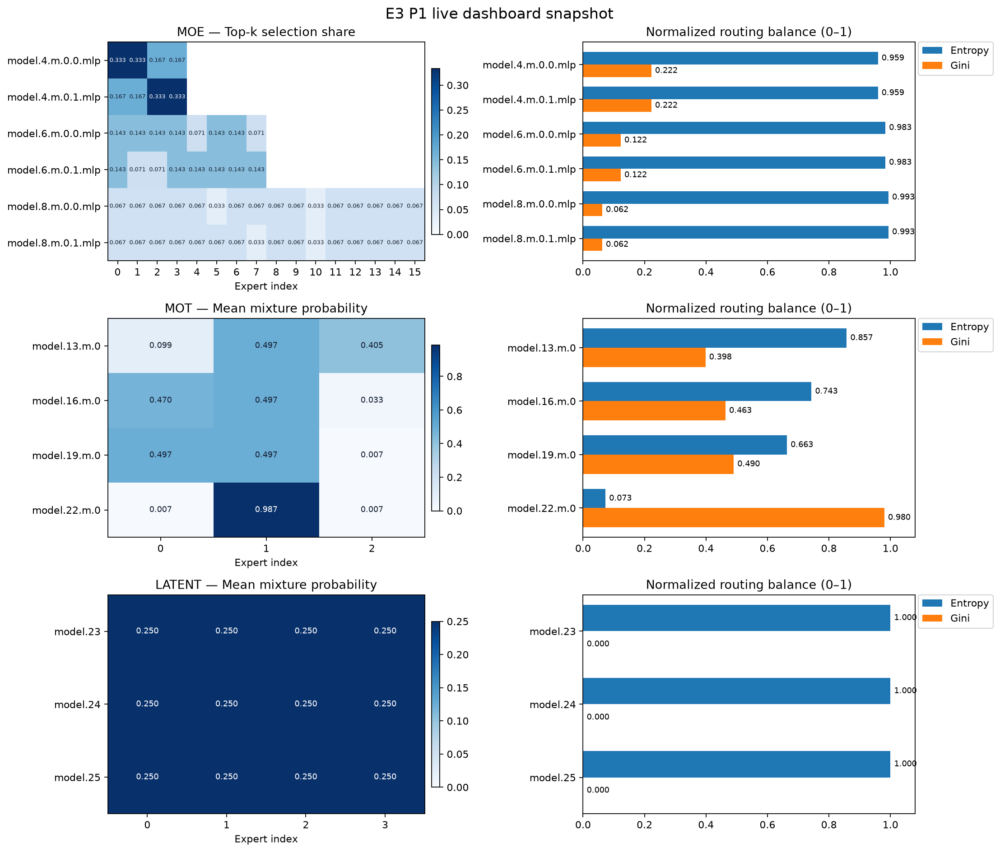

# E3 Routing Observer · P1

P1 在 [P0 统一采集库](https://github.com/XavierYChen/e3-routing-p0) 上增加两项验收能力：

1. 不依赖云服务的本地实时路由面板，覆盖 MOE、MOT、LATENT；
2. 真实 COCO8 训练 on/off、AB/BA 交替、重复测量和置信区间，门槛为中位减速 <10%。

阶段导航：[Smoke](https://github.com/XavierYChen/e3-routing-smoke) · [P0](https://github.com/XavierYChen/e3-routing-p0) · **P1（本仓库）** · [P2 token 原图叠加与演示](https://github.com/XavierYChen/e3-routing-p2)。

实时面板使用浏览器原生 HTML/JavaScript，每秒读取原子更新的 `latest.json`。训练线程同时追加 `routing_records.jsonl`，断电前的历史仍然保留。没有修改腾讯核心 forward。

## 已验证结果

2026-09-07 在 Windows 11、Intel i7-12700H CPU 上完成真实 COCO8 配对训练。每族运行 7 组，每组分别关闭和开启采集；每次 5 epochs。三族的中位减速均低于 P1 的 10% 门槛。

| 路由族 | 中位减速 | bootstrap 95% 区间 | 写入记录 | 结论 |
|---|---:|---:|---:|---|
| MOE | +2.97% | -5.08% ～ +11.08% | 210 | 通过 |
| MOT | +1.57% | +0.51% ～ +5.37% | 140 | 通过 |
| LATENT | +4.21% | -0.14% ～ +7.89% | 105 | 通过 |





完整证据位于 [`results/verified-p1-cpu-v2-20260907`](results/verified-p1-cpu-v2-20260907)：包含原始批次时间、42 个独立 worker 结果、训练日志、实时面板数据、静态图和 SHA-256 清单。MOT 的 95% 区间由 3 次重复时的 -4.25%～+14.26% 收窄为 7 次重复时的 +0.51%～+5.37%。MOE 仍有一次明显的 CPU 调度异常值，因此报告中同时保留原始配对值和区间；验收结论按任务要求使用中位减速。

### 为什么 LATENT 都是 0.25

这是腾讯 LATENT 配置的可复现初始化状态，不是绘图补值。三个 `LatentMixture` 都有 4 个专家，配置把 `router_init_std` 和 `residual_init` 设为 `0.0`；实现因此把路由输出层权重、偏置初始化为 0，softmax 后自然得到 `[0.25, 0.25, 0.25, 0.25]`。本基准只有 10 个训练 batch，目的是测量采集基础设施开销，不是训练检测模型收敛。JSON 中的 `source=last_routing_snapshot` 和非空辅助损失证明这些数值来自真实 forward 快照。若研究路由分化，可在独立实验配置中使用非零 `router_init_std`、延长训练并绘制随 step 变化的曲线；P1 不为获得“更好看”的图修改腾讯原配置。

## 运行基准

```bat
cd /d D:\AI\E3-Routing-P1
set "E3_YOLO_MASTER_ROOT=D:\AI\YOLO-Master"
set "E3_P0_ROOT=D:\AI\E3-Routing-P0"
set "E3_PYTHON=D:\AI\envs\yolo_master\python.exe"
run_benchmark.cmd
```

打开某次 on 运行的面板：

```bat
run_dashboard.cmd results\你的运行目录\dashboard\moe\rep-0
```

浏览器访问 `http://127.0.0.1:8765/dashboard.html`。服务器只监听本机。

测试采集和面板逻辑：

```bat
run_tests.cmd
```

## 口径

- 每族 7 个重复，off/on 与 on/off 交替执行。
- 每次 5 epochs，batch=2，imgsz=64，CPU，FP32，workers=0。
- 每次丢弃第一个 batch 作为 warm-up。
- 默认每 2 个 batch 采集一次；on 的平均 batch 时间包含 hook 采集、校验、JSONL 追加和 `latest.json` 更新。
- 先计算每个重复的 on/off 平均 batch 时间比值，再报告 7 个重复的中位减速和 bootstrap 95% 区间。
- 每个条件在独立 Python 进程中运行；相同重复的初始模型、输入 batch 和逐 batch loss 必须完全配对，否则基准直接失败。
- 默认删除框架生成的 1 GB 以上临时 checkpoint；如确需保留，可传入 `--keep-train-artifacts`。

实现范围、测量解释和已知问题见 [`limitations.md`](limitations.md)，验收逐项证据见 [`docs/ACCEPTANCE.md`](docs/ACCEPTANCE.md)。

